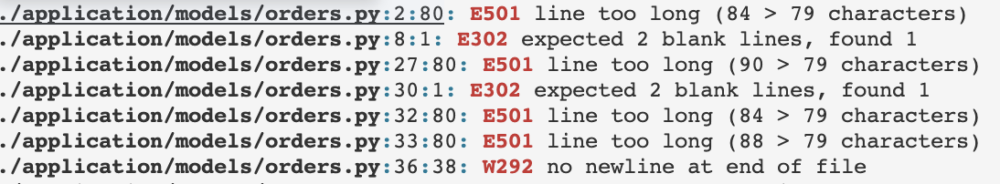

# Refractoring Process for Webshop Application

## Refraction Workflow

## Focus of Refractoring

- checkout functionality (./application/orders/routes.py)

### Static Code Analysis

We used flake8 to analysise the file and made the necessary changes. Screenshot below:

### Code Smells We Identified and Solutions We Applied

- [] Long Method/Function: Separate the main function into smaller helper functions, each with a specific purpose
- [] Misleading Name: Use more descriptive function and variable names
- [] Dispensables: Remove unnecessary print statements and comments
- [] Duplicate code:
- [] There are magic numbers in the code(ie. fixed shipping rates)
Note:due to third integration usage, further look into this will be needed.